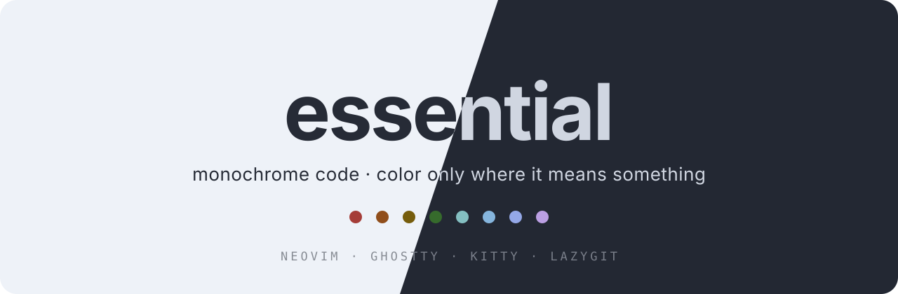
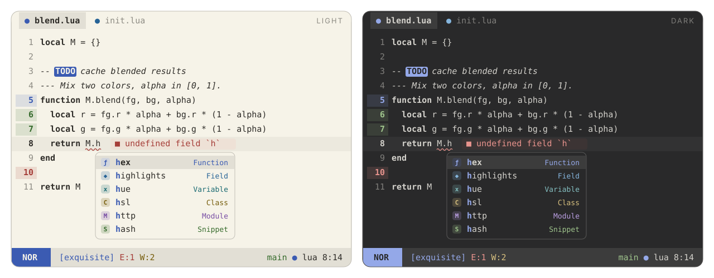

<p align="center">
  
</p>

<p align="center">
  <b>Only exceptional colors.</b><br>
  A monochrome Neovim colorscheme that uses color only where it carries meaning.
</p>

<p align="center">
  
  
  
</p>

---

<p align="center">
  
</p>

## Philosophy

Most colorschemes paint every token a different hue. After a while the rainbow
stops telling you anything. **exquisite** does the opposite:

- **Code is one color.** Keywords, strings, functions and types all use the
  same foreground. You tell them apart by shape, not hue. Comments are
  italic and keywords are bold by default, and you can change both.
- **Color only where it means something:**
  | Where | Colors |
  | --- | --- |
  | Git (gitsigns, diff, lazygit) | add **green** · change **blue** · delete **red** |
  | Diagnostics | error red · warn yellow · info blue · hint cyan · ok green |
  | LSP completion kinds (blink.cmp, dropbar) | one color per kind, the same everywhere |
  | File icons (mini.icons) | real icon colors |
  | Search, `TODO` / `FIXME` / `NOTE` markers | attention colors |
- **Easy on the eyes.** The light variant uses warm paper with near-black ink.
  The dark variant uses neutral gray with off-white text. Every accent passes
  **WCAG AA (≥ 4.5:1)** on both the background and the selection color
  (`scripts/contrast.lua`).

## Features

- Two variants, `light` and `dark`, plus `exquisite`, which follows
  `'background'`. Neovim 0.10+ detects the terminal background (OSC 11), so the
  theme matches your terminal automatically.
- **Extreme performance.** Highlights are compiled to stripped LuaJIT
  bytecode with integer colors. A cached load is a single `loadfile()` and runs in
  **about 4 ms**, roughly 2× faster than the built-in `habamax`. The cache is
  keyed by a hash of your config, so it never goes stale.
- Built for **Neovim 0.12**. It covers every group the default colorscheme defines,
  plus `OkMsg`, `StderrMsg`, `StdoutMsg`, `DiffTextAdd`, `PmenuMatch`, `PmenuBorder`,
  `PmenuShadow`, `ComplMatchIns`, `SnippetTabstop*`, `DiagnosticVirtualLines*`,
  `LspReferenceTarget`, treesitter captures and LSP semantic tokens.
- **Matching themes for other tools**, generated from the same palette:
  Ghostty, Kitty and Lazygit.

## Supported plugins

| Plugin | Notes |
| --- | --- |
| [blink.cmp](https://github.com/saghen/blink.cmp) | menu, docs, signature, ghost text, **colored kinds** (also `CmpItemKind*`) |
| [mini.icons](https://github.com/echasnovski/mini.icons) | real icon colors |
| [mini.pick](https://github.com/echasnovski/mini.pick) / [mini.extra](https://github.com/echasnovski/mini.extra) | |
| [mini.files](https://github.com/echasnovski/mini.files) | |
| [mini.tabline](https://github.com/echasnovski/mini.tabline) | modified buffers in the git "change" blue |
| [gitsigns.nvim](https://github.com/lewis6991/gitsigns.nvim) | signs, `numhl`, `linehl`, inline, preview, staged, blame |
| [dropbar.nvim](https://github.com/Bekaboo/dropbar.nvim) | kind icons colored like the completion menu |
| [grug-far.nvim](https://github.com/MagicDuck/grug-far.nvim) | |
| [mason.nvim](https://github.com/mason-org/mason.nvim) | |
| [lazy.nvim](https://github.com/folke/lazy.nvim) | |
| [nvim-treesitter](https://github.com/nvim-treesitter/nvim-treesitter) | captures incl. `@markup.*`, `@diff.*`, `@comment.todo` … |

## Installation

[lazy.nvim](https://github.com/folke/lazy.nvim):

```lua
{
  "amonteirom96/exquisite-color.nvim",
  lazy = false,
  priority = 1000,
  build = ":ExquisiteCompile",
  opts = {},
  config = function(_, opts)
    require("exquisite").setup(opts)
    vim.cmd.colorscheme("exquisite")
  end,
}
```

Native `vim.pack` (Neovim 0.12):

```lua
vim.pack.add({ "https://github.com/amonteirom96/exquisite-color.nvim" })
require("exquisite").setup({})
vim.cmd.colorscheme("exquisite")
```

### Colorschemes

| Command | Behavior |
| --- | --- |
| `:colorscheme exquisite` | follows `'background'` (or the `variant` option) |
| `:colorscheme exquisite-light` | always light |
| `:colorscheme exquisite-dark` | always dark |

## Configuration

Calling `setup()` is optional. These are the defaults:

```lua
require("exquisite").setup({
  variant = "auto",          -- "auto" (follow 'background') | "light" | "dark"
  transparent = false,       -- no background on Normal, floats and the sign column
  terminal_colors = true,    -- set g:terminal_color_0..15
  dim_inactive = false,      -- slightly different background on unfocused windows
  muted_comments = false,    -- comments in the muted UI tone instead of the code color
  float = {
    solid = false,           -- filled floats with an invisible border
  },
  styles = {                 -- any nvim_set_hl attributes (bold, italic, underline…)
    comments = { italic = true },
    keywords = { bold = true },
    functions = {},
    variables = {},
    strings = {},
    types = {},
    constants = {},
    operators = {},
  },
  integrations = {           -- set to false to skip a plugin's groups
    blink = true,
    dropbar = true,
    gitsigns = true,
    grug_far = true,
    lazy = true,
    mason = true,
    mini = true,             -- icons, pick, extra, files, tabline
    semantic_tokens = true,
    treesitter = true,
  },
  cache = true,              -- compile to bytecode (turn off only while hacking on the theme)

  --- Change the palette before any highlight is built.
  ---@param colors exquisite.Colors
  ---@param variant "light"|"dark"
  on_colors = function(colors, variant) end,

  --- Add or change highlight groups.
  ---@param hl table<string, vim.api.keyset.highlight>
  ---@param colors exquisite.Colors
  ---@param variant "light"|"dark"
  on_highlights = function(hl, colors, variant) end,
})
```

### Examples

**Pure monochrome.** No bold or italic anywhere:

```lua
require("exquisite").setup({
  styles = { comments = {}, keywords = {} },
})
```

**Warmer paper, and a different accent for matches and prompts:**

```lua
require("exquisite").setup({
  on_colors = function(c, variant)
    if variant == "light" then
      c.bg = "#f8f1de"
    end
    c.accent = c.purple
  end,
})
```

**Custom statusline groups:**

```lua
require("exquisite").setup({
  on_highlights = function(hl, c)
    local modes = {
      Normal = c.blue, Insert = c.green, Visual = c.red,
      Replace = c.orange, Command = c.purple, Other = c.cyan,
    }
    for mode, color in pairs(modes) do
      hl["StMode" .. mode] = { fg = c.bg, bg = color, bold = true }
      hl["StMode" .. mode .. "Sep"] = { fg = color, bg = c.surface2 }
    end
    hl.StProject = { fg = c.blue, bg = c.surface2 }
    hl.StGit = { fg = c.green, bg = c.surface2 }
    hl.StError = { fg = c.diag.error, bg = c.surface2 }
    hl.StWarn = { fg = c.diag.warn, bg = c.surface2 }
    hl.StInfo = { fg = c.diag.info, bg = c.surface2 }
    hl.StHint = { fg = c.diag.hint, bg = c.surface2 }
    hl.StLsp = { fg = c.accent, bg = c.surface2 }
  end,
})
```

## Palette

| Key | Light | Dark | Used for |
| --- | --- | --- | --- |
| `bg` | `#f6f3e8` | `#29292a` | background |
| `fg` | `#2e2c28` | `#d4d2cc` | **all code** |
| `red` | `#a53d38` | `#e8938d` | git delete, errors |
| `orange` | `#904e1b` | `#e0a574` | kinds (enum, constant) |
| `yellow` | `#765d0c` | `#d6bf7e` | warnings, search |
| `green` | `#366b2c` | `#9fc48c` | git add, ok, snippets |
| `cyan` | `#1a6a72` | `#84bfc1` | hints, variables |
| `azure` | `#266396` | `#85b5dd` | fields, properties |
| `blue` | `#3b5bb2` | `#94a8e8` | git change, info, functions, `accent` |
| `purple` | `#764ba3` | `#bb9fe3` | modules, keywords (kinds) |

UI tones are derived from `fg` and `bg`: `surface1`, `surface2`, `surface3`,
`border`, `muted` and `bg_dim`. `muted` appears only in UI chrome, such as line
numbers and whitespace. It never appears in code.

Use the palette in your own config:

```lua
local c = require("exquisite").colors()        -- current variant
local light = require("exquisite").colors("light")
local groups = require("exquisite").highlights("dark")
```

## Extras

Themes for other tools live in [`extras/`](extras). They are generated from the
palette and include your `on_colors` overrides when you regenerate them:

```vim
:ExquisiteExtras [output-dir]
```

| Tool | Files | Setup |
| --- | --- | --- |
| **Ghostty** | `extras/ghostty/exquisite-{light,dark}` | copy to `~/.config/ghostty/themes/`, then `theme = light:exquisite-light,dark:exquisite-dark` |
| **Kitty** | `extras/kitty/exquisite-{light,dark}.conf` | copy them to `~/.config/kitty/light-theme.auto.conf` and `dark-theme.auto.conf` to follow the OS theme, or `include` one |
| **Lazygit** | `extras/lazygit/exquisite-{light,dark}.yml` | `LG_CONFIG_FILE=~/.config/lazygit/config.yml,~/.config/lazygit/exquisite-dark.yml` |

Lazygit's diff colors come from your terminal's ANSI palette, so they follow the
Ghostty or Kitty theme automatically.

## Commands

| Command | Description |
| --- | --- |
| `:ExquisiteCompile` | Rebuild the bytecode cache. Run it after updating the plugin, or after changing values captured inside an `on_*` closure. |
| `:ExquisiteClearCache` | Delete the cache (`stdpath("cache")/exquisite`). |
| `:ExquisiteExtras [dir]` | Generate the Ghostty, Kitty and Lazygit themes. |

## Development

```sh
# contrast check (WCAG AA for every accent, both variants)
nvim --headless -u NONE --cmd "set rtp^=." -l scripts/contrast.lua
# smoke tests
nvim --headless -u NONE --cmd "set rtp^=." -l tests/smoke.lua
# load-time benchmark
nvim --headless -u NONE --cmd "set rtp^=." -l scripts/bench.lua
# regenerate extras and README images from the palette
nvim --headless -u NONE --cmd "set rtp^=." -c "lua require('exquisite').extras()" -c q
nvim --headless -u NONE --cmd "set rtp^=." -l scripts/assets.lua
```

When you change highlight definitions, bump `M.version` in
`lua/exquisite/init.lua`. This invalidates every user's compiled cache.

## License

[MIT](LICENSE)
